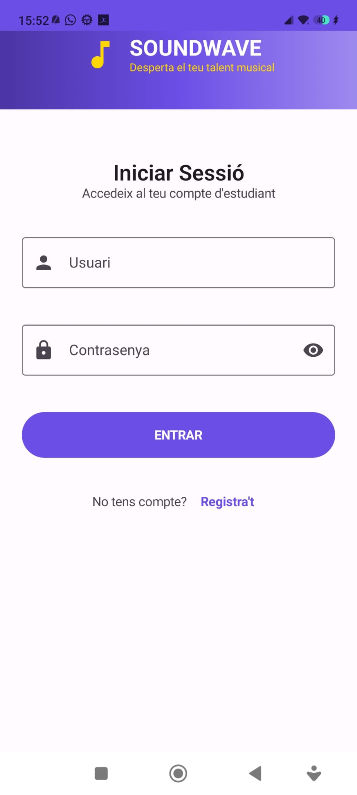
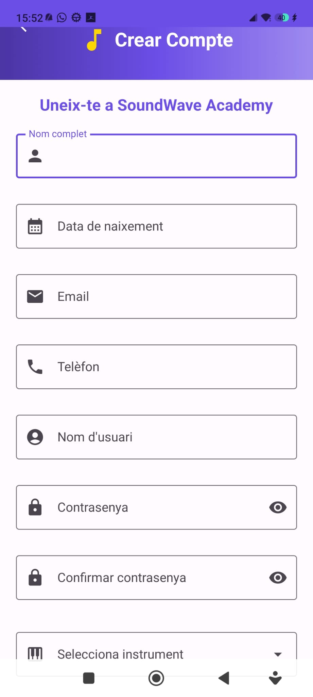
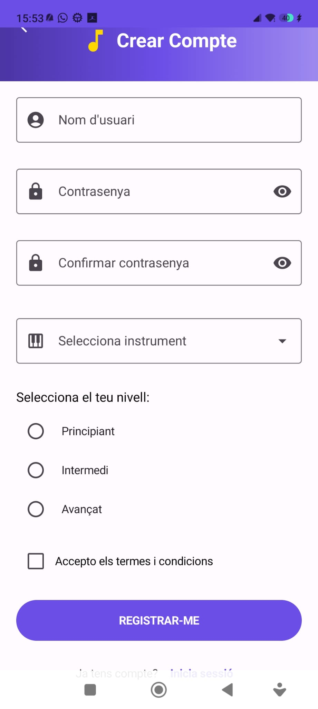
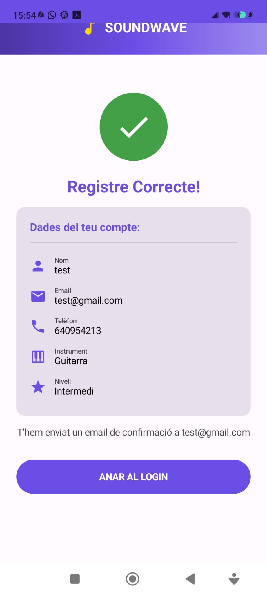

# PR07 - Responsive & Adaptive Design 🎵+

App Android que implementa diseño **responsive** y **adaptive** para un sistema de login y registro de usuarios.

Se adapta a tres tamaños de pantalla diferentes (Compact, Medium, Expanded) y responde a cambios de orientación (vertical/horizontal).

## Descripción

Gestiona de usuarios para **SOUNDWAVE Academy**, una plataforma de clases de música. 

## Estructura

```
com.example.responsiveadaptative/
├── model/                
│   ├── Usuario.kt
│   ├── EstadoRegistro.kt
│   └── EstadoLogin.kt
├── navegacion/           
│   ├── Navegacion.kt
│   └── Rutas.kt
├── viewmodel/           
│   └── RegistroViewModel.kt
├── view/
│   ├── screens/          
│   │   ├── LoginScreen.kt
│   │   ├── RegistroScreen.kt
│   │   └── ConfirmacionScreen.kt
│   └── theme/           
├── MainActivity.kt
└── ui/theme/            
```

**Flujo:**
1. Usuario introduce datos en la View
2. View actualiza el ViewModel
3. ViewModel valida y emite estado
4. View observa cambios en LiveData
5. UI se actualiza automáticamente

## Responsive & Adaptive

### Tres Tamaños de Pantalla

#### **COMPACT** (Móvil: < 600dp)
- Layout vertical de una sola columna
- Scroll para ver todo el contenido
- Banners 
- Campos apilados

#### **MEDIUM** (Tablet pequeña: 600-840dp)
- Layout con 2 columnas en formularios
- Campos en paralelo (nombre + fecha)
- Más espacio aprovechado
- Formulario en Card centrada

#### **EXPANDED** (Tablet grande: > 840dp)
- Layout con paneles laterales
- Formulario central
- Paneles de información (instrumentos, contacto)
- Mucho espacio aprovechado

### Responsive (Orientación)

La app se adapta automáticamente cuando:
- Giras el dispositivo (landscape)
- Cambias el tamaño de la ventana
- Usas split-screen

**En LoginScreen:**
- Título a la izquierda
- Formulario a la derecha
- Disposición en Row en lugar de Column

## 🎨 Pantallas

### 1. **LoginScreen**
Pantalla de inicio de sesión con:
- Campo usuario
- Campo contraseña (con botón mostrar/ocultar)
- Validación de campos vacíos
- Enlace a registrase



### 2. **RegistroScreen**
Pantalla de registro con:
- Formulario completo 
- Dropdowns para instrumento
- Radio buttons para nivel
- Checkbox de términos
- Validaciones




### 3. **ConfirmacionScreen**
Pantalla con:
- Datos del usuario registrado
- Información de login
- Próximas clases
- Botones de navegación



## Composables

**WindowSizeClass** - Detección automática de tamaño  
**BoxWithConstraints** - Responsive dinámico  

**Rutas:**
- `login` -> LoginScreen
- `registro` -> RegistroScreen
- `confirmacion_registro` -> ConfirmacionScreen (tipo="registro")
- `confirmacion_login` -> ConfirmacionScreen (tipo="login")


